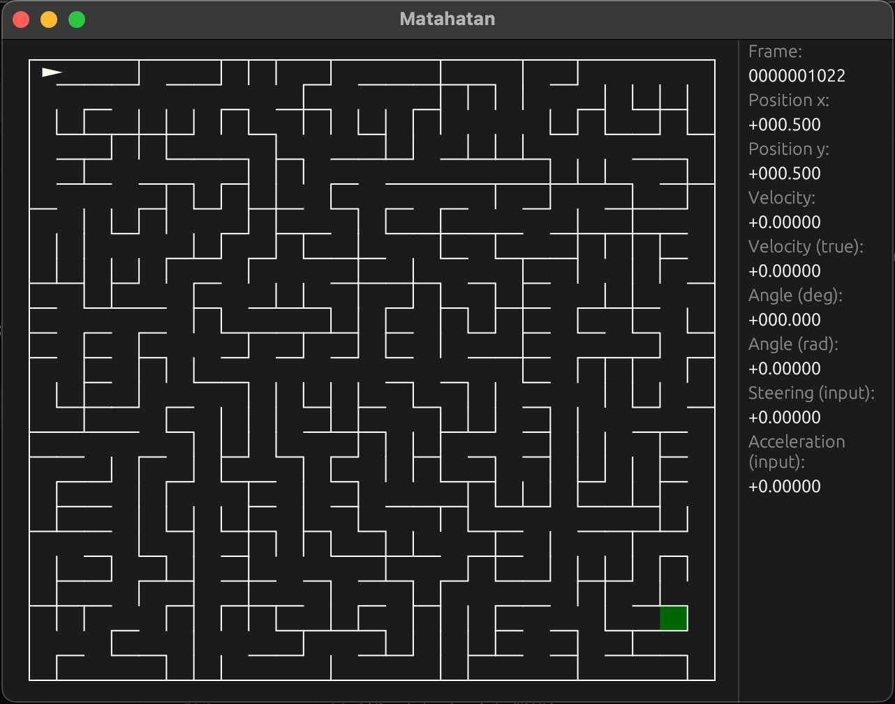

# Matahatan

Virtual Maze Solving Challenge

[Micromouse](https://youtu.be/kMOssi5IcP0?si=2qSlp-7MrDTbPzCF&t=13)

Move the mouse to the goal of the maze in the least frames. You can steer
left/right, accelerate and break. If the mouse is fast, the turning radius is
large so you have to break before corners. It is a about balance of speed and
finding the best path. Write a program that solves the maze.

## State

* stick-mode working
* stdio-mode working

## stdio

- you get the maze as json
- input: `{"steering":1,"acceleration":1}`
- output: `{"x":0.5092106,"y":0.5038942,"angle":0.4,"collision":false}`

### maze

- n: north passage exists
- o: east passage exists
- s: south passage exists
- w: west passage exists

coordiates of output (x, y: f32) match index of the passages (floor(x), floor(y)).

## Command-line

Not implemented options are removed. (--lua)

```
Test/train your maze-solver

Usage: matahatan simulate [OPTIONS]

Options:
  -f, --fps <FPS>              FPS of the simulation not the GUI (0 as fast as
                               possible) [default: 25]
  -x, --no-gui                 Do not run GUI (unattended training) sets FPS to 0
  -o, --stdio                  Run the simulation in stdio-mode (disables FPS)
  -s, --stick                  Run the simulation with stick (gamepad/joystick)
  -m, --maze-seed <MAZE-SEED>  Maze seed (any string) [default: ]
  -k, --maze-kind <MAZE-KIND>  Maze kind ('ellers', 'backtracking',
                               'growing_tree', 'prims') [default: backtracking]
  -h, --help                   Print help
```

Run from source: `cargo run --release -- simulate --stdio`

## Screenshot


